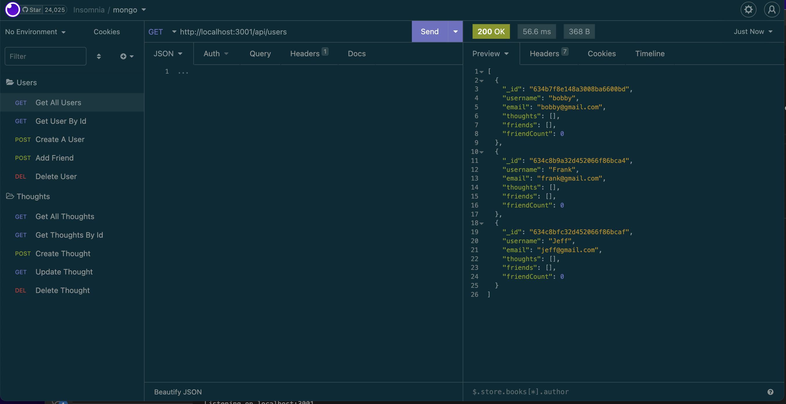
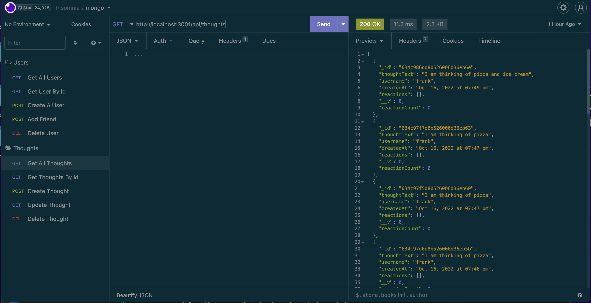

# Social-Network-API
 Social Network Application that uses Express.js for routing, a MongoDB database, and the Mongoose ODM.

# Descriptions

This application allows the user to interact with the database by a url based API. The user can update thoughts, react to friends thoughts, and create a friend list. As a web developer it is good to have a good understanding of the connection between the database and the API.

# Visuals 

USERS 

THOUGHTS

## Connect With Me

[Linkedin](https://www.linkedin.com/in/alexjenkins85/)